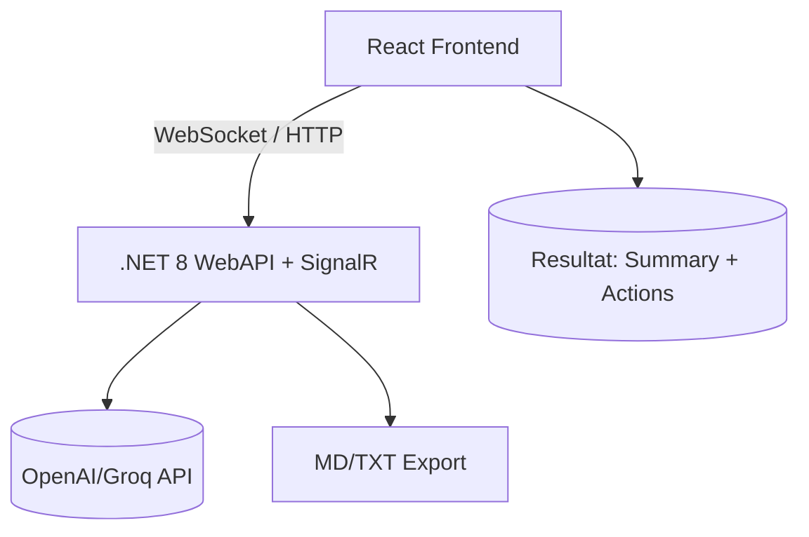

# Examensarbete – AI Meeting Assistant

## 1. Projektöversikt
**Titel:** AI-baserad realtidsassistent för mötesanteckningar  
**Sammanfattning:** Webbaserad lösning där användaren klistrar in mötestext och får realtidsanalys via WebSockets. AI genererar automatiskt sammanfattningar och action items. Fokus på modern teknik, lärande och minimal kostnad.

---

## 2. Mål & leverabler
**Huvudmål:** Färdigt MVP – text → AI → realtids-stream → resultat i UI  
**Delmål:**  
- v44: Projektstart & idé klar  
- v45: Projektplan + arkitektur godkänd  
- v46: AI-integrering backend  
- v47: Redigerbara resultat i UI  
- v48: Exportfunktion + testplan  
- v49: Demo redo  
- v50: Slutrapport + presentation  

---

## 3. Intressenter & målgrupp
- Primär: Studenter och yrkesgrupper som snabbt vill få struktur på mötesanteckningar
- Sekundär: Handledare, kursledare och framtida arbetsgivare

---

## 4. Scope

**Ingår**
- React + TypeScript + Vite  
- .NET 8 WebAPI + SignalR realtid  
- AI-sammanfattning via OpenAI/Groq  
- Export (.md/.txt)  
- MVP-design med cardlayout

**Ingår ej**
- Rösttranskribering  
- Teams/Zoom-integration  
 - Autentisering  
- Historikvisning (stretch)

---

## 5. Milstolpar & tidsplan

| Vecka | Milstolpe | Leverabel |
|------|------------|-----------|
| 44 | Projektstart | MVP scope klart |
| 45 | Plan godkänd | Projektplan + arkitekturdiagram |
| 46 | AI-integrering | OpenAI/Groq kopplad till API |
| 47 | UI-funktion | Redigerbara summaries & actions |
| 48 | Export & test | Exportfunktion + manuell testplan |
| 49 | Demo redo | UI-polish + demoscript |
| 50 | Slutleverans | Rapport + live-presentation |

---

## 6. Arkitekturdiagram

---

## 7. Backlog – User Stories

| ID | User Story | Status |
|----|------------|--------|
| U1 | Klistra in mötestext för analys | * |
| U2 | Starta analys med en knapp | * |
| U3 | Se realtidsprocess | * |
| U4 | Få genererad sammanfattning | * |
| U5 | Få lista med action items | * |
| U6 | Redigera resultat | Pågår |
| U7 | Exportera resultaten | Kommer |
| U8 | Tilldela ansvar/deadlines (stretch) | Ej påbörjad |
| U9 | Se historik (stretch) | Ej påbörjad |

---

## 8. Risklogg

| Risk | Sannolikhet | Konsekvens | Åtgärd |
|------|-------------|------------|--------|
| API-kostnader | Medium | Medium | Begränsa input, billig modell |
| SignalR-komplexitet | Medium | Medium | Enkelt hub-flöde |
| UI växer för mycket | Medium | Low | Minimal UI |
| Tidspress | Medium | High | Hårt MVP-scope |

---

## 9. Kvalitetssäkring
- Manuell testplan
- UI review löpande
- Feature-branches + Pull Requests
- Demo & feedback varje vecka

---

## 10. Demo & Presentation
**Scenario**  
1. Ange mötesnamn  
2. Klistra in anteckningar  
3. Klicka *Analyze* → realtids-feedback  
4. Exportera sammanfattning & actions

**Fokus**: AI-värde + Realtidsupplevelse

---

## 11. Godkännande

| Titel | Namn | Datum |
|-------|------|-------|
| Student | Andreas Vilhelmsson | 2025-XX-XX |
| Handledare | Marcus Ackre Medina | 2025-XX-XX |

---

*Dokumentet är under utveckling och uppdateras löpande.*
